# Gitコマンド
## git clone
`git clone` は「既存のリモートリポジトリ」をローカル環境に複製するコマンド

`git　clone リモートリポジトリのURL` 指定されたリモートリポジトリをローカル環境に複製する

## git branch
`git branch`はローカルブランチの一覧を表示するコマンド  

`git branch -r`　リモートブランチの一覧を表示する  
`git branch ブランチ名` 新しいブランチを作成する  
`git branch -d ブランチ名` 指定したブランチを削除する

## git switch
`git switch`はブランチを切り替えるコマンド  

`git switch ブランチ名`　指定されたブランチに移動する  
`git switch -c ブランチ名` 現在のブランチから新しいブランチを作成する  
`git switch -c ブランチ名 develop` developブランチを派生元として新しいブランチを作成する

## git add
`git add`は更新されたファイルの中身をインデックスに追加するコマンド  

`git add ファイル名` 指定したファイルをインデックスに追加する  
`git add .` 変更された全てのファイルをインデックスに追加（その階層のファイルをまとめてインデックスに登録する）  
`git add -A` 新規追加、更新、削除のファイルが対象になる。ファイル名の指定を省略できる。その場合は作業ブランチの全てのファイルが対象になる  
オプションがない場合との違いはファイル名の指定を省略できること  
`git add -u` 更新、削除のファイルが対象になり、新規追加のファイルは対象にならない。ファイル名の省略が可能で、その場合は作業ブランチの全てのファイルが対象になる  

`git add -p` はファイルの一部の変更をインデックスに追加したいときのコマンド  
実行すると`Stage this hunk [y,n,q,a,d,e,?]? `が表示され、
`y` はインデックスに追加され、`n`はインデックスへの追加がキャンセルされる。`?`を押すと選択肢の一覧が表示される  
`e`を押すとvimの編集モードに入ることができる。
- -を取り消したい場合 → ‘-‘を空欄に”  
- +を取り消したい場合 → その行を消す  

コマンド上で`y`や`n`などユーザーが入力して処理を進めることを「インタラクティブモード（対話モード）」という

### git addでフォルダを追加したいとき
空のフォルダは`git add`できないので、新規追加したいフォルダの中にファイルを作成してから`git add`してコミットする必要がある  

## git commit
`git commit`はファイルやディレクトリの変更をリポジトリ記録するコマンド  
`git commit`のみを実行すると、vimの編集画面になり、コミットメッセージを入力してからコミットされる

`git commit -m "コミットメッセージ"` コミット時にメッセージを追加する  
`git commit --amend` 直前のコミットが修正される

## git push
`git push`はローカルリポジトリのコミット履歴をリモートリポジトリに送信して更新するコマンド

`git push origin ブランチ名` 指定したブランチをリモートリポジトリ上の同名のブランチに送信する  
現在作業中のブランチ（例:241007-git-note）を追加する場合は、`git push origin 241007-git-note`とする  
`git push origin HEAD`でも作業中のブランチをpushすることができる。

### git pushだけ実行したら
`The current branch 241007-git-note has no upstream branch.`のエラーでpushできない。  
これは「上流ブランチがありません」という旨のエラー
上流ブランチとは上の例で言うと`origin/241007-git-note`のこと（リモート追跡ブランチ）  
ローカルブランチと上流ブランチが設定できていないので、エラーになる  
上流ブランチとして設定すると、`git push`するときにリモートリポジトリ名とブランチ名を省略できる(`git push`だけでpushできるようになる)  
上流ブランチの設定は`git branch -u <リモートブランチ名>`で設定できる  
また、作業ブランチを最初にpushする時に`git push -u origin <ローカルブランチ>`とすることで、上流ブランチを設定することができる  
一度設定すれば、そのあとのpush時は`git push`でブランチ名を入れずにpushできる

`-u`は`--set-upstream-to=`と同じ

## git merge
2つのブランチを1つに統合する  
`git merge <統合したいブランチ名>`で統合できる。  
mainブランチと作業用のブランチがあり、作業用のブランチの変更をmainブランチ反映したい時は、  
1. mainブランチに移動
2. `git merge <作業用ブランチ>`する  

例：作業ブランチ（branchA）で作業中に、mainの変更があり、mainの変更を作業ブランチに取り込みたい時
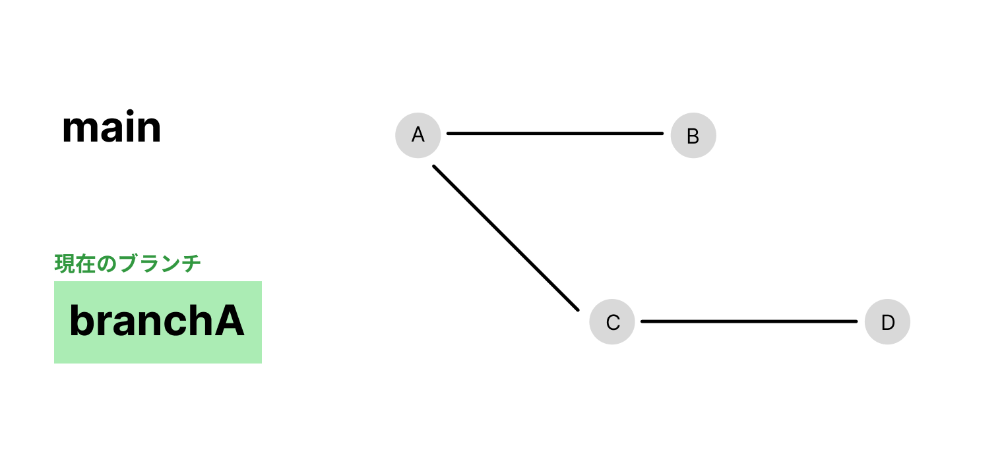
`git merge main` でmainブランチの変更を作業ブランチに取り込むことができる
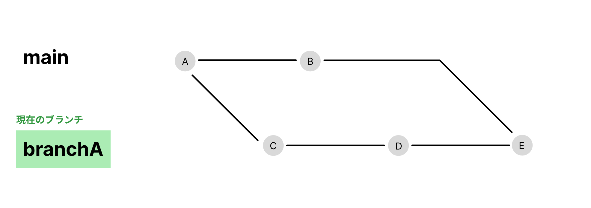

## git pull
リモートリポジトリで起きた変更をローカルリポジトリに反映する  
`pull`は`fetch`と`merge`を合わせたもの  
`git pull <リモートリポジトリ名> <ブランチ名>` でローカルリポジトリの現在のブランチにリモートリポジトリの変更を取り込むことができる。  
mainブランチをpullしたいときは、  
1. mainブランチに移動
2. `git pull origin main`する  

### git fetch
コミット履歴の情報を取得している。  
`git fetch` でリモート追跡ブランチが更新される。この時、ローカルブランチは更新されない。mergeすることでローカルブランチが更新される。

## git rebase
rebaseは、コミットを作り直すことができるコマンドである。  
rebaseを使うことで、ログをきれいにしたり、コミットの適用場所を変更したりすることができる。

例えば、作業中のブランチ（branchAとする）で作業中に、mainブランチで変更があった時、mainブランチの最新のコミットから作業中ブランチのコミット履歴を繋げることができる。これにより、コミット履歴を一本化することができる
1. ブランチの基点を変更したいブランチに移動(例の場合だと、branchAに移動)
2. `git rebase <リベース先のブランチ名>` （例の場合だと`git rebase main`）

ただし、rebaseをするとコミットIDが書き換わる（新たなコミットとなる）ので、すでにリモートリポジトリにpushしたコミットをリベースするときは注意が必要である。  
### コミットIDが書き換わることで起こりうる問題
- チームメンバーとの同期不一致  
チームで開発している場合、他のメンバーがすでにリモートの履歴を取得しているとき、rebaseによって履歴が異なると、pullやmergeの時に競合が発生したり、他メンバーが重複コミットを取り込んでしまうことがある。
- リモートへの強制pushが必要になる  
rebase後にリモートリポジトリへプッシュしようとすると、通常のpushでは履歴が一致しないため、エラーとなる。このため`--force`オプションで強制的にpushしなければならず、リモートの履歴を上書きしてしまう危険がある。誤って上書きすると、他の人のコミットが失われたりするリスクがあるため、慎重に操作しなくてはいけない
- 参照ができなくなる  
特定のコミットIDを使用してバグ修正やレビューの参照を行っている場合、IDが書き換わることですでにレビューしている参照が無効になってしまう

### git mergeとの違いは何か
`git merge`をすると新たにマージコミットが作成され以下のような履歴になる  

`git rebase`を実行すると、mainの最新コミットの後に作業ブランチのコミットが続くようになる。こうすることで、分岐や合流がなく、コミット履歴がきれいになり、ログが見やすくなる
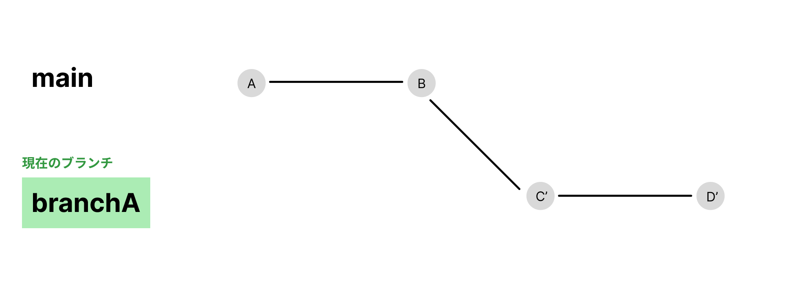

### git rebaseのその他のオプション
`git rebase -i <コミットID>` 複数のコミットをまとめたり、コミットメッセージを修正したり削除することができる  
`<コミットID>`は変更したいコミットのひとつ前のコミットIDを指定する（`HEAD@{n}`の形でもOK）  

`git rebase -i <コミットID>`を実行すると以下のような画面になる
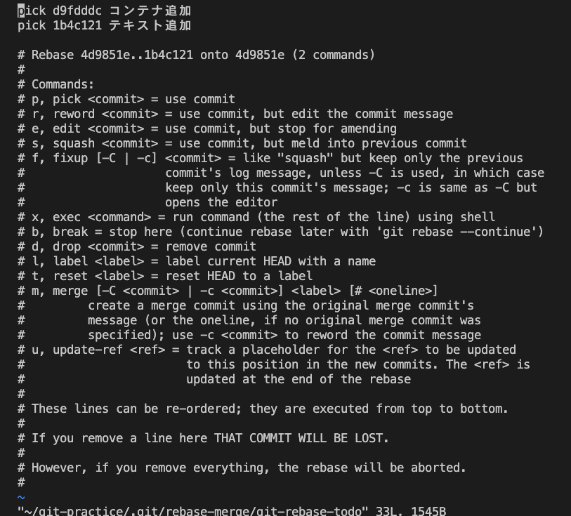
- `pick` コミットをそのまま使う
- `reword` そのコミットメッセージだけを変更する
メッセージを変更したいコミットに`reword`を入力
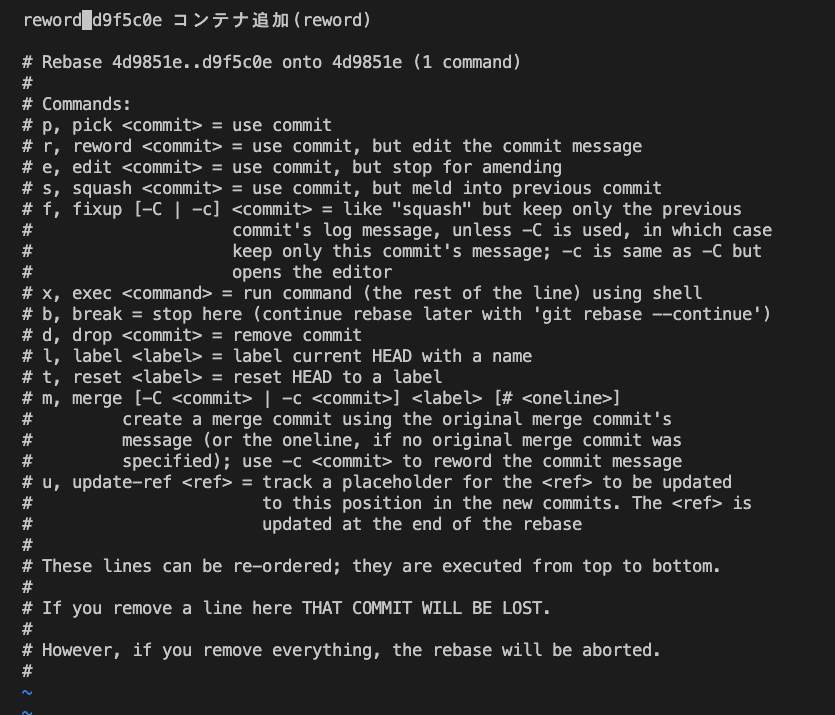  
メッセージを編集
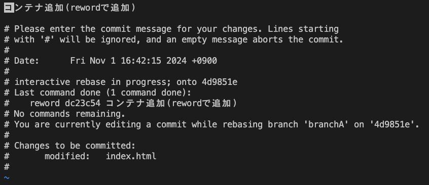  
メッセージが書き換わる

- `edit` そのコミットに対して変更を加えたい時
- `squash`または`s` そのコミットを前のコミットにまとめる
コミットをまとめたいコミットに`squash`を入力
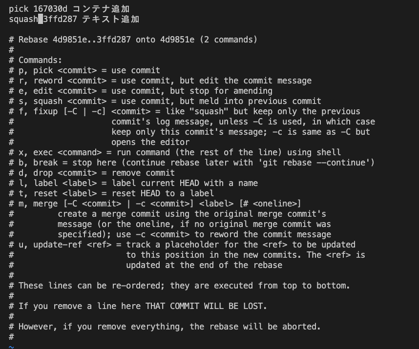
コミットメッセージの編集画面になるので、コミットメッセージを編集する
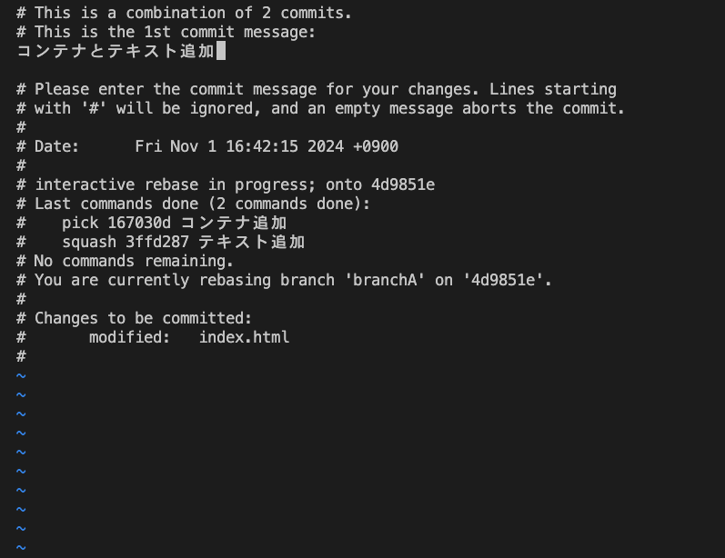
コミットがまとめられる
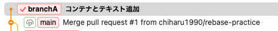
- `fixup` または`f` そのコミットを前のコミットにまとめ、メッセージを残さない
- `drop` そのコミットを削除する
削除したいコミットに`drop`を入力
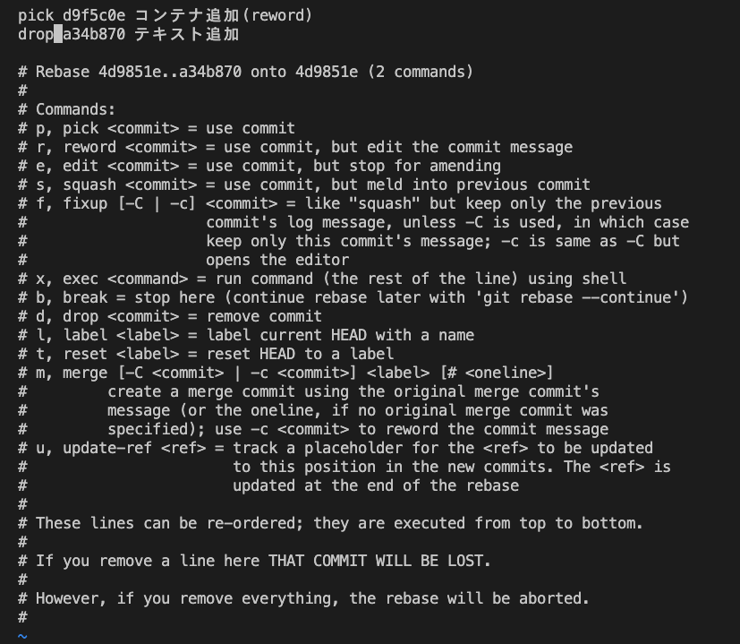
コミットが削除される
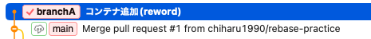

## git reset
`git reset` 特定の時点までファイルを巻き戻す  
リセットのオプションは大きく3種類ある  
`git reset --soft <巻き戻したいコミット位置>` HEADの位置のみ  
実行後はステージされた状態まで巻き戻る 
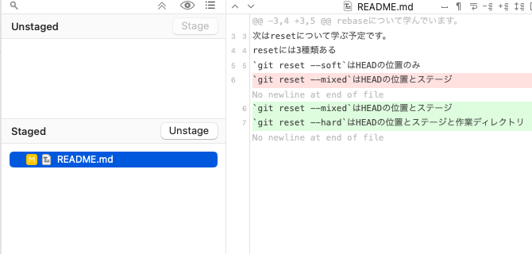
`git reset --mixed <巻き戻したいコミット位置>` HEADの位置・ステージ  
実行後はステージされていない状態まで巻き戻る  
また、`git reset <巻き戻したいコミット位置>`も同じ意味である
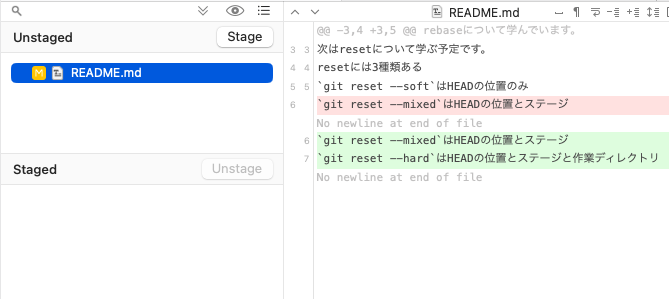
`git reset --hard <巻き戻したいコミット位置>` HEADの位置・ステージ・作業ディレクトリ  
実行後は、作業ディレクトリまで巻き戻る  
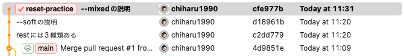
ステージもされておらず、作業の履歴も消える  

<巻き戻したいコミット位置>は  
`HEAD^` 直前のコミット  
`HEAD@{n}` n個前のコミット  
`コミットID` そのコミットIDまで巻き戻す

### コミットIDを調べるコマンド
- `git log` 各コミットのID、メッセージ、作成者、日時などが表示される
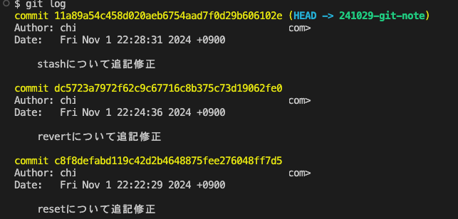
- `git log --oneline` コミットIDの短縮版とコミットメッセージが1行で表示される簡易版のログ
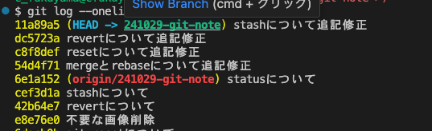
- `git reflog`すべてのHEADの履歴を確認することができる
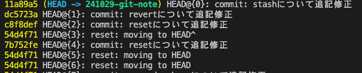

## git revert
指定したコミットと逆の内容をコミットする  
`git revert <打ち消したいコミットID>`  
例：index.htmlにテキストを追加してコミット後、別ファイル（index2.html）を追加してコミットした状態で、先に対応したindex.htmlのテキスト変更を取り消したい時  
1. `git reflog`を使って該当のコミットIDを調べる
2. `git revert <コミットID>`を実行
3. コミットメッセージの編集画面になるので、何も問題なければ`:wq`で抜ける
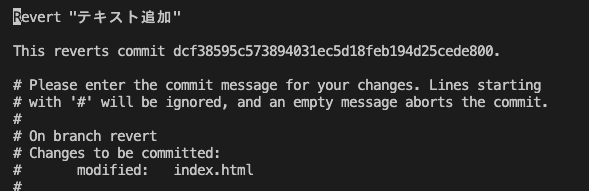
4. index.htmlで行った変更が打ち消されたものがコミットされる
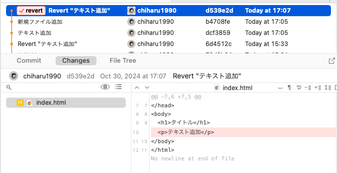

`git-revert`は新たにコミットをするコマンドで、`git reset`のようにコミット履歴を改変することはない。

## git stash
現在の作業内容を一時的に保存し、作業ディレクトリをクリーンにする  
`git stash save` 作業内容を保存する  
`git stash list`  保存したリストを表示する  
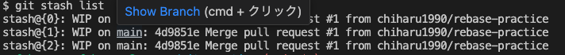
stash@{n}は各スタッシュの個別の名前  
`git stash apply stash@{n}` 復活したいスタッシュの名前を指定して作業内容を復活する  
`git stash drop stash@{n}` スタッシュの削除  
`git stash pop stash@{n}` スタッシュの復活と削除を同時に行う  
また、`git stash apply`のようにstash番号を指定しない場合、一番最後にスタッシュに保存した内容が復活する。

## git status
作業ディレクトリの現在の状態を確認するもの  
`git status`を実行すると以下のように表示される  
- On branch → 現在のブランチ名
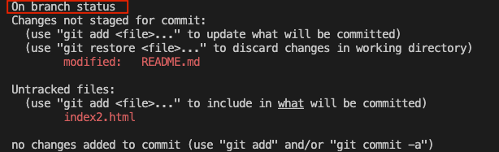
- Your branch is up to date with 'origin/branch_name'... → リモートブランチとの同期情報
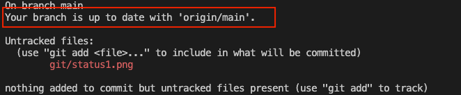
- Changes to be committed: → ステージングエリアにある次回コミットで追加される予定のファイル
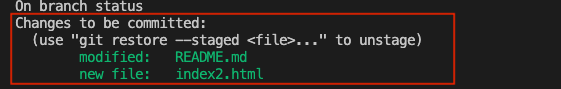
- Changes not staged for commit: → 追跡されているファイルの中で変更されているがステージングされていないファイル
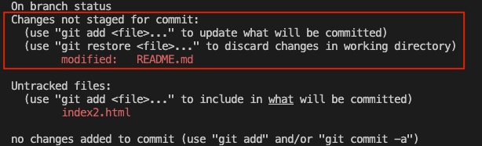
- Untracked files: → 新規作成されたが、gitにまだ追跡されていないファイル
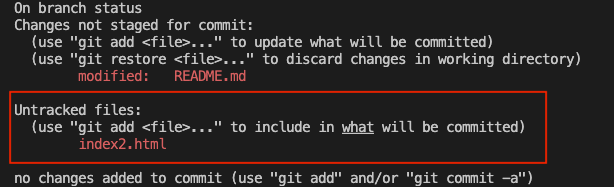

`git status -s` 状態を簡潔に表示する（`-s`は`--short`と同じ）
- `M` 修正されたファイル
- `A` ステージングされた新しいファイル
- `??` 追跡されていないファイル